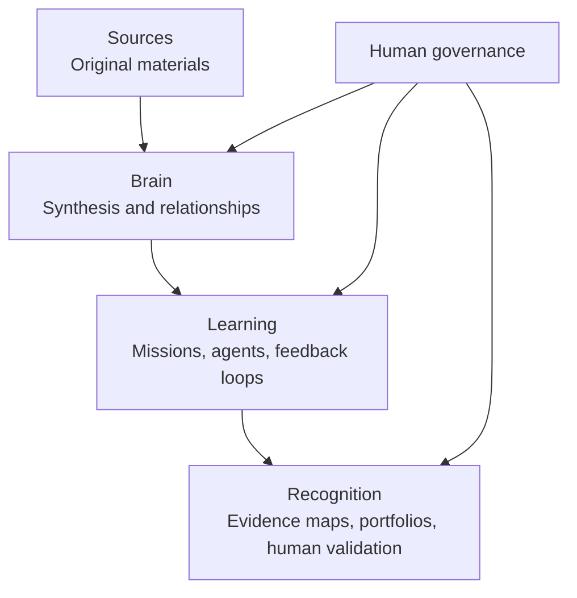

# OpenLab OS Architecture

## System model



## Layer boundaries

| Layer | Folder | Primary question | Typical artifact |
|---|---|---|---|
| Sources | `sources/` | What original material exists? | Source record, PDF note, dataset record |
| Brain | `brain/` | What does the material mean together? | Concept brief, research map |
| Learning | `learning/` | What will learners and agents do? | Mission, rubric, reflection workflow |
| Recognition | `recognition/` | What can humans responsibly validate? | Evidence map, validation record |

## Supporting directories

| Directory | Purpose |
|---|---|
| `skills/` | AI operating instructions by domain |
| `templates/` | Reusable artifact structures |
| `examples/` | Small, safe demonstrations |
| `governance/` | Policies, decision records, approval rules |
| `prototypes/` | Experimental technical work; no production claims |
| `data/synthetic/` | Public-safe fictional examples only |

## Artifact routing rules

```text
Raw reference? → sources/
Synthesis of sources? → brain/
Task, mission, workflow, prompt, rubric? → learning/
Proof, validation, badge recommendation, portfolio? → recognition/
Reusable AI instruction? → skills/
Reusable structure? → templates/
Test example? → examples/
```

## Architectural rule

**Never use a recognition artifact as a source of truth for the original work.**

The evidence and reflection trail belongs upstream in Sources, Brain, and Learning. Recognition records point back to that trail.

## Growth path

### Genesis
Clear rules, synthetic examples, no real student data.

### Pilot
A small teacher-supervised mission, a rubric, and a documented evidence trail.

### Validated
Multiple reviewed cases, explicit limitations, measurable evaluation results.

### Reference
Stable patterns others can adapt with documentation and governance guidance.

### Certified
Only after a legitimate, authorized human or institutional process defines what certification means.
